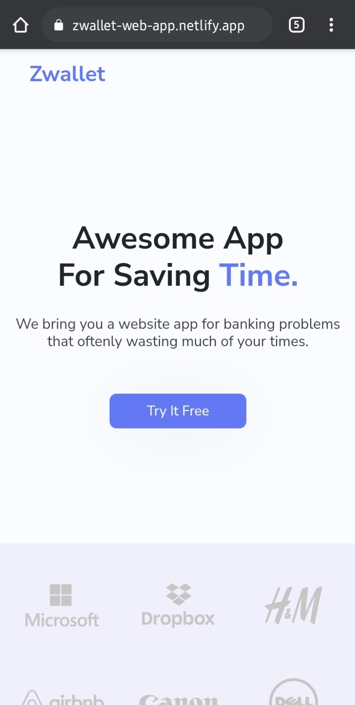
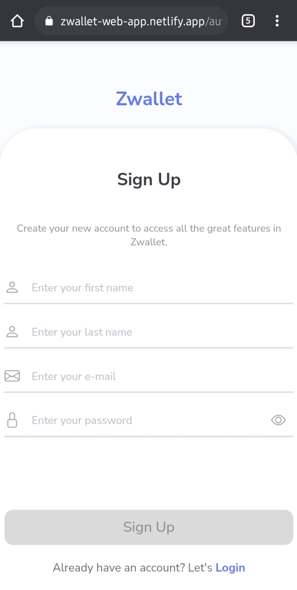
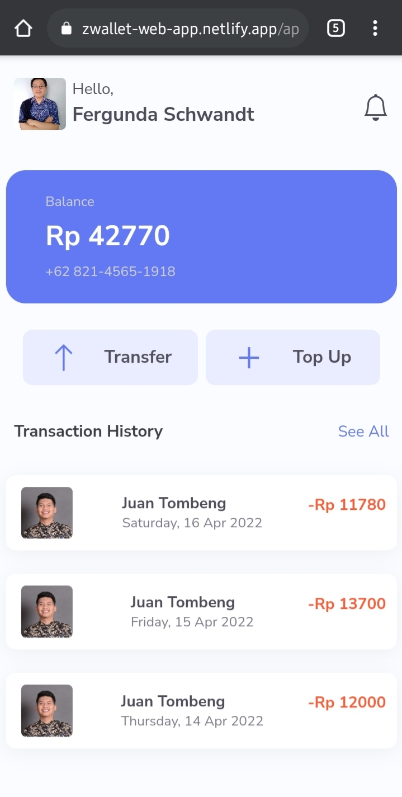
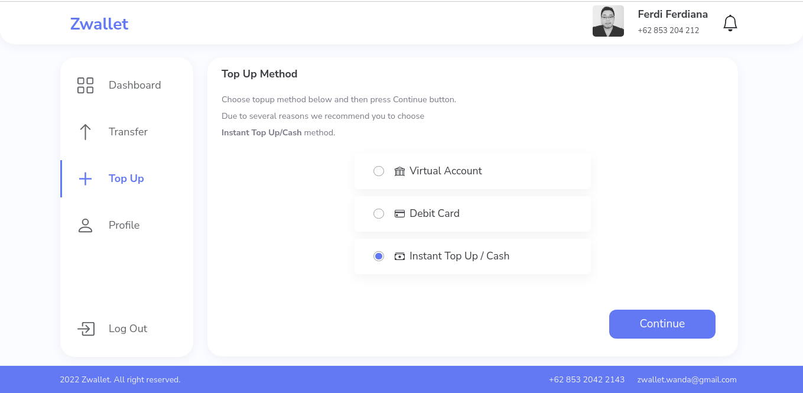
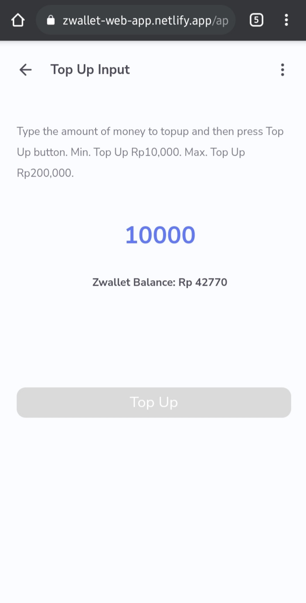
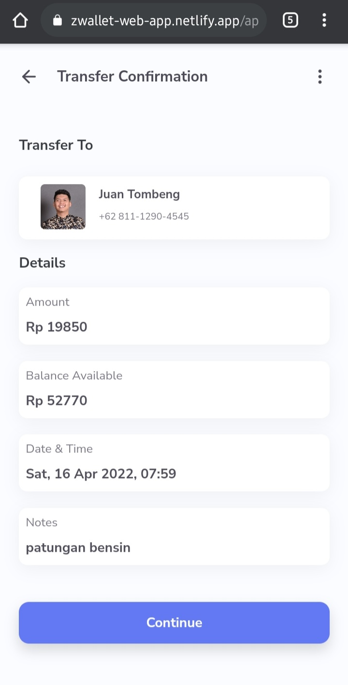

<div id="top"></div>

<!-- PROJECT LOGO -->
<br />
<div align="center">
  <a href="https://github.com/ferdianfh/zwallet-web-app">
    
  </a>

  <h3 align="center">Zwallet</h3>

  <p align="center">
    An Awesome App For Saving Time
    <br />
    <a href="https://github.com/ferdianfh/zwallet-web-app"><strong>Explore the docs »</strong></a>
    <br />
    <br />
    <a href="https://zwallet-web-app.netlify.app">View Demo</a>
    ·
    <a href="https://github.com/ferdianfh/zwallet-web-app/issues">Report Bug</a>
    ·
    <a href="https://github.com/ferdianfh/zwallet-web-app/issues">Request Feature</a>
  </p>
</div>

<!-- ABOUT THE PROJECT -->

## About The Project


**Zwallet** is A Digital Wallet Website Based Application that offering the simplicity and rapidity for anything related to banking needs, such as, Top Up and Transfer activity.

<p align="right">(<a href="#top">back to top</a>)</p>

### Built With

This app was built with some technologies

- [ReactJS](https://reactjs.org/)
- [Redux](https://redux.js.org/)
- [Axios](https://axios-http.com/)
- [Bootstrap](https://getbootstrap.com)
- [Netlify](https://www.netlify.com/)
- [Backend APIs](https://github.com/ferdianfh/zwallet-backend-api)

<p align="right">(<a href="#top">back to top</a>)</p>

## Getting Started

### Prerequisites

- npm
  ```sh
  npm install npm@latest -g
  ```
- Clone Zwallet APIs Repository and follow the installation guide here:
  [Zwallet Backend APIs](https://github.com/ferdianfh/zwallet-backend-api)

### Installation

1. Clone the repo
   ```sh
   git clone https://github.com/ferdianfh/zwallet-web-app.git
   ```
2. Move to project directory
   ```sh
   cd folder-project
   ```
3. Install NPM packages
   ```sh
   npm install
   ```
4. Start the Application
   ```sh
   npm start
   ```

## Demonstration

Or you can try it here: [Zwallet Web App](https://zwallet-web-app.netlify.app)

Login as user:

```sh
email: aziz@gmail.com
password: azizpass123
PIN: 111222 (DO NOT CHANGE THE PIN!!!)
```

## Snippets

Here are some snippets about this app:

> Web page

|                          Landing Page                           |                           Landing Page Mobile                            |
| :-------------------------------------------------------------: | :----------------------------------------------------------------------: |
|  |  |
|                        Registration Page                        |                         Registration Page Mobile                         |
|     |   |
|                         Dashboard Page                          |                          Dashboard Page Mobile                           |
|   |   |
|                           Top Up Page                           |                            Top Up Page Mobile                            |
|       |           |
|                          Transfer Page                          |                           Transfer Page Mobile                           |
|    |     |

<p align="right">(<a href="#top">back to top</a>)</p>

## Related Project

[Zwallet Backend APIs](https://github.com/ferdianfh/zwallet-backend-api)

## Zwallet Update!

**Zwallet** is currently on development process!

<p align="right">(<a href="#top">back to top</a>)</p>

<!-- CONTACT -->

## Contact

Ferdi Ferdiana - [Linkedin](https://www.linkedin.com/in/ferdianfh/) - ferdifh82@gmail.com

<p align="right">(<a href="#top">back to top</a>)</p>
